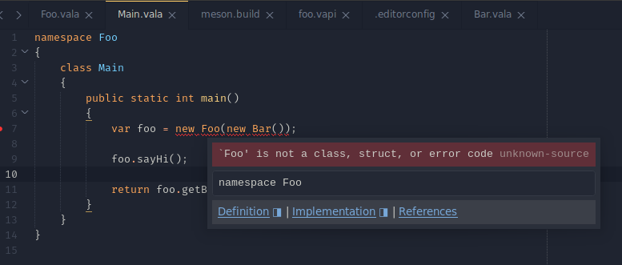

# Vala bug on throw signature when generating vapi files and a class has the same namespace name

## Tested versions

- Vala 0.48.18
- Vala 0.52.4

## Reproducing

```console
meson build
meson compile -C build
```

On last step, meson will compile successfully the library and generate the vapi
file.

When compiling the executable, will output this error:

```
ninja: Entering directory `build'
[1/3] Compiling Vala source ../src/Main.vala foo.vapi
FAILED: foo.p/src/Main.c
valac -C --debug --debug --pkg gio-2.0 --color=always --directory foo.p --basedir ../ ../src/Main.vala foo.vapi
foo.vapi:14.31-14.43: error: The symbol `Exception' could not be found
                public void sayHi () throws Foo.Exception.PrintError;
                                            ^^^^^^^^^^^^^
Compilation failed: 1 error(s), 0 warning(s)
ninja: build stopped: subcommand failed.
```

This is because when generating the vapi output, the following signature:

```vala
public void sayHi () throws Foo.Exception.PrintError;
```

When it should be:

```vala
public void sayHi () throws global::Foo.Exception.PrintError;
```

Or:

```vala
public void sayHi () throws Exception.PrintError;
```

To better illustrate the example, a `Bar` class was created to demonstrate how
the signatures are generated in the vapi file. To my understanding, it should
work the same way for the `throws` signature:

```vala
public Foo (global::Foo.Bar bar);
```

## Additional bug catch?

Also, I've noticed that when using Vala Language Server, it does not recognize
the dependency to `libfoo` and shows an error in `Main.vala`:


